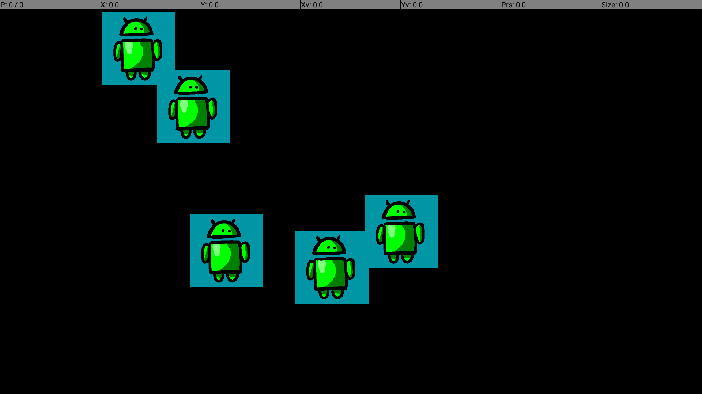

Android TV screensaver sample using DreamService
====================================================

This Android TV screensaver sample uses DreamService of Android to show how to write dreams, which are interactive screensavers launched when an Android TV device is idle.

Introduction
------------

- [Read more about Android TV introduction](http://www.android.com/tv/)
- [Android TV Developer Documentation](http://developer.android.com/tv)
- [Android TV apps in Google Play Store](https://play.google.com/store/apps/collection/promotion_3000e26_androidtv_apps_all?hl=en)
- [Android DreamService] (http://developer.android.com/reference/android/service/dreams/DreamService.html)

Pre-requisites
--------------

* Android API Level 17 or later
* Android SDK v7 appcompat library
* Android SDK v17 leanback support library
* Android SDK v7 recyclerview library

Getting Started
---------------

- Fetch code by git clone https://github.com/googlesamples/atv-daydream.git
- Open it in Android Studio
- Compile and deploy to your Android TV device.
- [More info about getting started](https://developer.android.com/training/tv/start/start.html)

Screenshots
-----------

Support
-------

- Android TV Google+ Community: [https://g.co/androidtvdev](https://g.co/androidtvdev)
- Stack Overflow: http://stackoverflow.com/questions/tagged/android-tv

License
-------
Licensed under the Apache 2.0 license. See the LICENSE file for details.

How to make contributions?
--------------------------
Please read and follow the steps in the CONTRIBUTING.md
